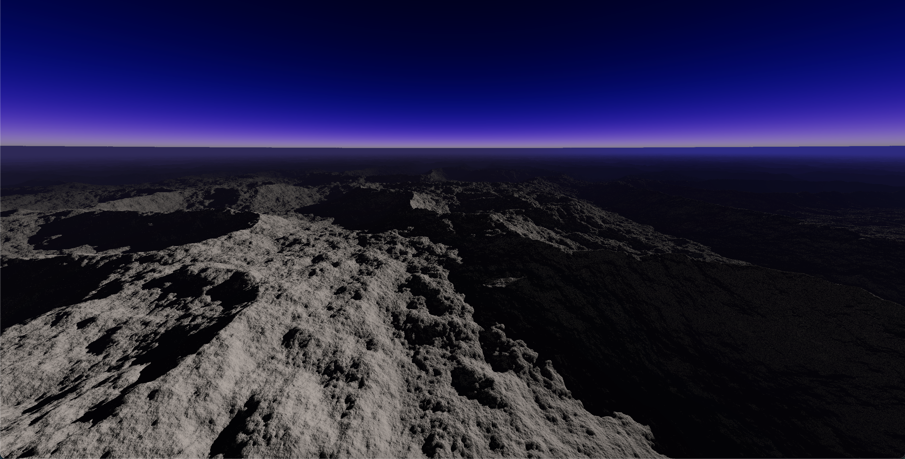

# Terrain
## Overview
This project demonstrates how to generate and render a 3D terrain using raymarching. Raymarching is a technique for rendering complex 3D scenes by calculating the distance from the camera to the nearest surface using a Signed Distance Field (SDF). The terrain is defined mathematically, allowing for smooth transitions, infinite detail, and dynamic surface generation without the need for complex geometry.

## Features
- `Procedural Terrain Generation:` The terrain is procedurally generated using noise and fbm functions to define its height and surface details.
- `Raymarching Algorithm:` The scene is rendered using raymarching, which marches rays from the camera into the scene, estimating the distance to the terrain surface.
- `Dynamic Lighting:` Includes Phong lighting models to add realistic shading and highlights on the terrain.
- `Shadows`
- `Fog and Atmosphere:` Adds atmospheric effects such as fog to enhance the depth perception of the terrain.

## License
This project is licensed under the MIT License. See the LICENSE file for details.

